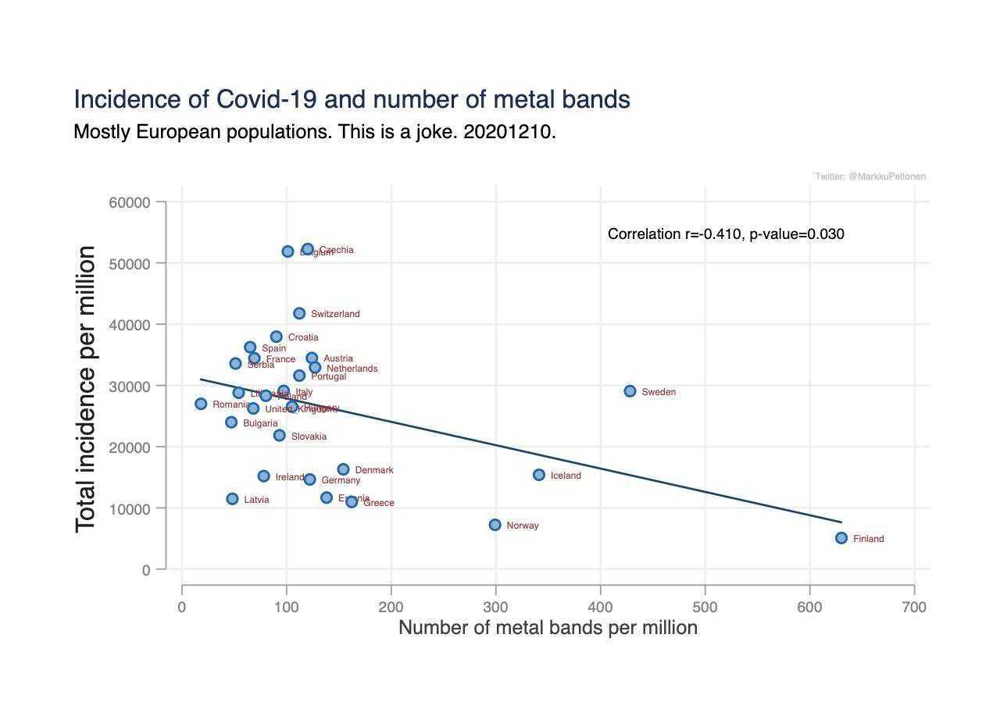
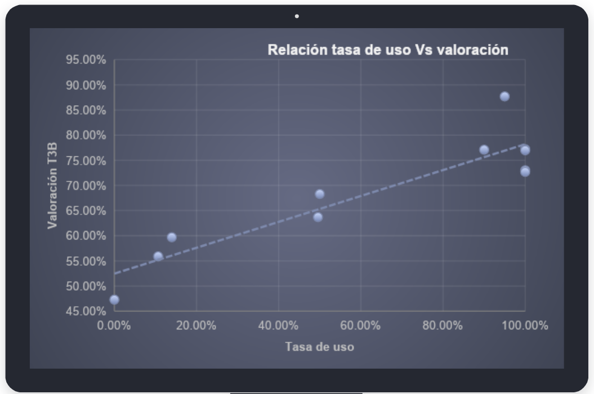
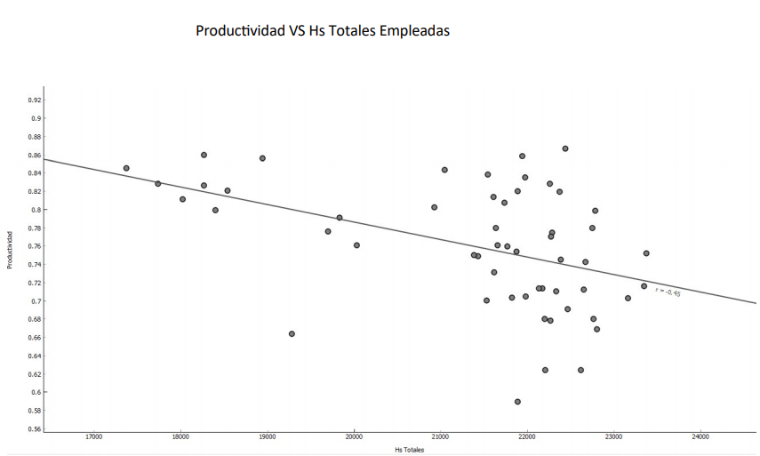

```{r setup, include=FALSE}
library(learnr)
knitr::opts_chunk$set(echo = FALSE, message = FALSE, warning = FALSE)
```

## Pensamiento Estadístico en People Analytics: Regresiones Lineales

Los análisis de regresión son un tipo de análisis que permiten descubrir la relación entre dos o más variables, y estimar su resultado a futuro. En particular, las regresiones lineales por su simplicidad, hace que sea fácil entender conceptualmente de qué se trata y comprender sus resultados. De hecho, [Walter Sosa Escudero](https://www.linkedin.com/in/walter-sosa-escudero-a23454110/) en su libro [Big Data: breve manual para conocer la ciencia de datos que ya invadió nuestras vidas](https://sigloxxieditores.com.ar/libro/big-data/) llama a las regresiones lineales ["los Rolling Stones del análisis de datos"](https://docs.google.com/document/d/1Q-SjKOaZnQwHW_OixsFM80-KDSydwWlTv49ZCPVfEYY/edit?usp=sharing).

La **regresión lineal** es uno de los algoritmos más elementales para predecir **valores**. Hay muchos tipos de regresiones que abordan distintos tipos de problemáticas (por ejemplo la regresión logística estima probabilidades). Pero la regresión lineal lo que permite hacer es estimar el valor de una variable en función de las relaciones entre las variables.

Una de las cosas que tenemos que tener bien en claro con las regresiones lineales es que el resultado va a ser un **número**. Por ejemplo:

-   El gasto promedio *en función* de los ingresos.
-   El sueldo *en función* de los años de experiencia.

Una obviedad: La regresión lineal se representa con una línea que atraviesa los puntos, que como cuenta Walter Sosa Escudero, tiene la característica de ser una recta que pasa lo más cerca posible de todos los datos.

{width="653"}

## Aplicaciones en RRHH

Un par de ejemplos de aplicaciones en el ámbito de Recursos Humanos son los siguientes.

Cuando Telecom se fusionó con Cablevisión, el equipo de People Analytics tenía que ayudar a decidir qué beneficios de Telecom iban a mantener.

En Cablevisión habían realizado un análisis en el que descubrieron que mientras más se utilizaba un beneficio, mejor era su valoración. En la nueva empresa, no había información sobre la valoración de los beneficios pero si había información sobre la utilización de los beneficios.

{width="561"}

Para conocer el caso completo pueden ver la presentación en [YouTube](https://youtu.be/8bhFliOvFPY).

Otro caso interesante fue el que desarrollaron los alumnos de AGD en su TIF del 2020. Querían averiguar si había una relación entre la rentabilidad de la planta, y la realización de horas extras.

Descubrieron que hay una relación negativa entre la cantidad de horas totales trabajadas y la productividad de la planta. Este descubrimiento les permitió trabajar sobre lo que podían gestionar que son las horas extras.

{width="476"}

Antes de meternos con cómo realizar regresiones lineales vamos a hacer un repaso sobre algunos temas de estadística descriptiva para ir fijando conocimiento.

## Repaso: promedio

Usemos este pequeño dataset.

```{r edad, echo=TRUE}
library(readr)

edades <- read_delim("https://raw.githubusercontent.com/chechoid/pepaitba/main/inst/tutorials/pepa1/edades.csv",
                     delim = ",")

# Veamos los datos
edades
```

Calculemos el promedio de la variable `Edad`.

```{r, avg1, exercise=TRUE, exercise.setup="edad"}
mean(edades$___)

```

```{r avg1-hint}
# Coloca el nombre de la columna Edad
```

```{r avg1-solution}
mean(edades$Edad)
```

El promedio se dice que es una medida de **tendencia** **central**, en términos coloquiales esto quiere decir que el promedio es una medida que puede ser el valor más representativo de una variable.
